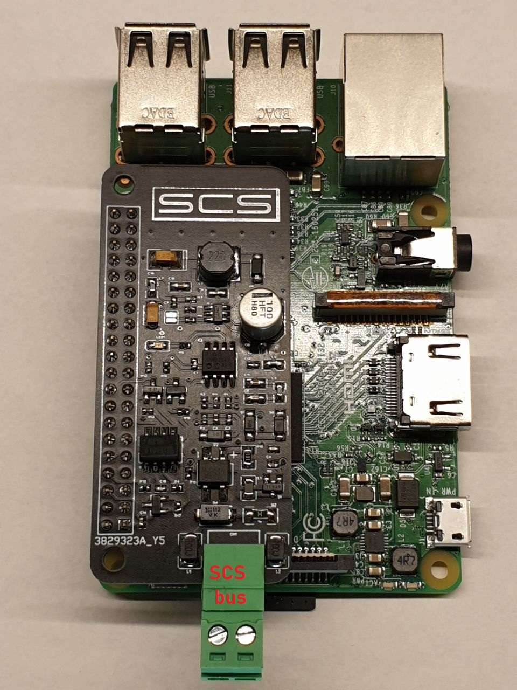

  <h1 align="center"> SCS-Raspberry-pi shield</h1>
  <h3 align="center">Senza Gateway</h3>
  
  

    <a href="https://scsshield.altervista.org/">https://scsshield.altervista.org/</a>
  

 

  

**Contatti**
* <code><a href="http://scsshields.altervista.org/contatti.html">Contatti</a></code>

**Caratteristiche**

* Raspberry completamente Isolata dal bus
* Configurazione semplice grazie alla web-app
* Possibilità di effettuare Test degli attuatori grazie alla web-app
* La comunicazione con la shield avviene in modo semplice tramite <code>MQTT</code>, con la possibilità dell'utente di sviluppare le proprie applicazioni con qualsiasi linguaggio desiderato comunicando tramite <code>MQTT Publish/Subscribe</code>

**Pin usati**

* UART0 TX (8)
* UART0 RX (10)
* GPIO 12 (32)

**HomeAssistent Peconfigurato**

<a href="https://drive.google.com/file/d/1Ub3w5bLfa4MsFImj2b4mugl0-CwWZRQA/view" target="_blank"> link </a>
* username= scs
* password= scs

